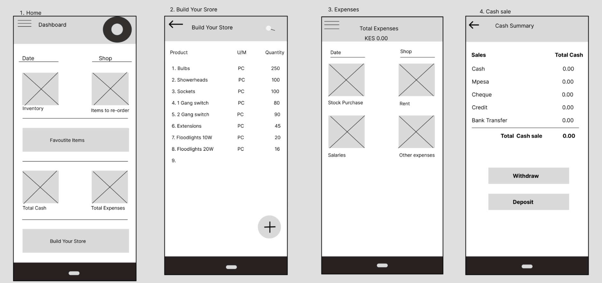
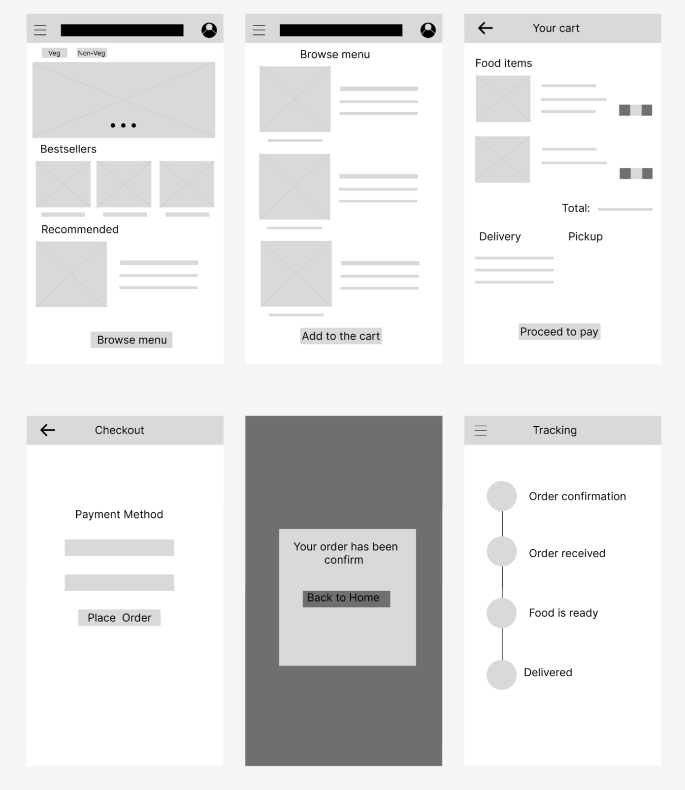

# 1. Персонажи
1. Придумайте тему проекта.
Это может быть приложение для смартфона, сайт, программа для декстопа.

2. Изучите целевую аудиторию. 

3. Придумайте двух персонажей, представляющих основные группы из целевой аудитории.
  Опишите:
  - Имя, возраст, род деятельности, образование, ...
  - Опыт использования ПК, смартфона, интернета. В том числе
       - как часто пользуется;
       - для чего чаще всего использует ;
       - зарегистрирован ли в социальных сетях, если да, то в каких?
       - часто ли регистрируется на сайтах?
       - участвует ли в создание контента (ведёт блог, создаёт посты, пишет комментарии и т.д.)

  - Общие цели персонажа. 
  - Цели персонажа, как потенциального пользователя. 
  - Что пользователя отпугивает и/или беспокоит.

4. Придумайте для каждого персонажа 1-2 сценария. В описание сценария включите следующее:

    Мотивацию: ситуация, при которой персонаж решил воспользоваться продуктом.
    Цель: чего пользователь хочет достичь.

### Рекомендации и дополнения

- Можно добавить фотографию пользователя, написать его краткую биографию и сказать пару слов о людях, кто влияет на его цели или действия.

- Создайте двух разных персонажей, представляющих отличимые друг от друга группы целевой аудитории. Описывайте себя самого, 
только если на 100% уверены в том, что вы типичный представитель одной из частей целевой аудитории :)

- Объём - до 300 слов.

# Задание 2. Use case диаграмма

Это задание можно выполнять в парах.

Для темы и персонажей, разработанных в предыдущей работе:
1. Кратко опишите ваш продукт. Приведите название.
2. Создайте диаграмму вариантов использования (use case диаграмму) ориентируясь на потребностях персонажей.\
   Сделайте диаграмму аккуратной и эстетичной. Обозначайте одним цветом схожие по смыслу прецеденты.\
   Используйте сервис https://draw.io и стандартные элементы из раздела UML.
3. Рядом с диаграммой приведите условные обозначения и пояснения для элементов этого вида диаграмм.
4. Приведите ответы на вопросы (см. ниже).
*3. Не обязательно: приведите спецификацию двух прецедентов.*
*4. Не обязательно: познакомьтесь с текстовым способом описания диаграмм https://plantuml.com/ru/use-case-diagram*

Следующие задания (4 и 5) посвящены созданию интерфейса пользователя и будут продолжением текущей работы.

Смотрите описание такого типа UML диаграмм в учебном пособии. Примеры диаграмм в дискорде. 

**Вопросы**
1. Назовите этапы проектирования (по Джессу Гаретту), опишите каждый этап.
7. Какие бывают модели пользователя? Чем они отличаются?
3. Зачем нужно моделировать потенциальных пользователей?
5. На основе какой информации описывается персонаж?
6. Что такое диаграмма прецедентов? Зачем она нужна?
8. Из каких элементов строится диаграмма прецедентов?
9. Опишите виды отношений между прецедентами и ролями. Приведите примеры таких отношений.

# Задание 2. Use case диаграмма

Это задание можно выполнять в парах.

Для темы и персонажей, разработанных в предыдущей работе:
1. Кратко опишите ваш продукт. Приведите название.
2. Создайте диаграмму вариантов использования (use case диаграмму) ориентируясь на потребностях персонажей.\
   Сделайте диаграмму аккуратной и эстетичной. Обозначайте одним цветом схожие по смыслу прецеденты.\
   Используйте сервис https://draw.io и стандартные элементы из раздела UML.
3. Рядом с диаграммой приведите условные обозначения и пояснения для элементов этого вида диаграмм.
4. Приведите ответы на вопросы (см. ниже).
*3. Не обязательно: приведите спецификацию двух прецедентов.*
*4. Не обязательно: познакомьтесь с текстовым способом описания диаграмм https://plantuml.com/ru/use-case-diagram*

Следующие задания (4 и 5) посвящены созданию интерфейса пользователя и будут продолжением текущей работы.

Смотрите описание такого типа UML диаграмм в учебном пособии. Примеры диаграмм в дискорде. 

**Вопросы**
1. Назовите этапы проектирования (по Джессу Гаретту), опишите каждый этап.
7. Какие бывают модели пользователя? Чем они отличаются?
3. Зачем нужно моделировать потенциальных пользователей?
5. На основе какой информации описывается персонаж?
6. Что такое диаграмма прецедентов? Зачем она нужна?
8. Из каких элементов строится диаграмма прецедентов?
9. Опишите виды отношений между прецедентами и ролями. Приведите примеры таких отношений.

# Задание 3. Информационная архитектура
Это задание можно выполнять в парах.
1. Создайте диаграмму страниц (окон, экранов).
Обозначьте страницы прямоугольниками. Стрелками покажите пути
перехода из страницы в страницу. Отдельные, частые, пути перехода можно
отметить пунктиром или не показывать, сделав об этом пометку. Например,
переход в корзину возможен почти с любой страницы сайта интернетмагазина.
В прямоугольнике страницы укажите её название и краткое (несколько слов)
содержание.
Помните об информационном дизайне самой диаграммы не только проекта
но и самой диаграммы. Закодируйте цветами разные категории страниц.
2. Проверьте: все ли прецеденты можно реализовать на этой диаграмме.
3. Проверьте: персонажам понравится такое устройство? Они разберутся как
решить свои задачи? Сценарии реализуются? Как попасть на нужную им
страницу?

**Рекомендации.**
 Во время работы держите в голове примерное содержание
страницы, окна или экрана, но не привязывайтесь к конкретному внешнему виду и
расположению элементов – здесь важно показать контент страниц и переходы.
Каждый из блоков диаграммы может быть воплощен множеством способов – этому
посвящены следующие задания.

# Задание 4. Грубый макет UI
Создайте в figma 3+ макета с указанием основных блоков элементов интерфейса.

1. Не выбирайте цвета, шрифты, изображения, конкретные тексты задайте только для самых важных элементов. Подберите размер шрифта.
1. Подпишите отдельные блоки, чтобы потенциальный заказчик, не разбирающейся в проектировании интерфейсов, смог понять ваш макет.
1. Сделайте между макетами интерактивный переход
2. Сгруппируйте элементы. Дайте группам понятные имена.
3. Создайте компоненты для повторяющихся блоков.
4. Создайте как минимум два варианта как минимум одного макета.
5. Поместите чеклисты на макет. Проверьте макеты.

Чеклист по структуре и организации работы:
- [ ] Есть фреймы, задана типичная ширина для предпологаемых устройств
- [ ] Сетки с полями, вынесены как стиль
- [ ] Элементы (слои) сгруппированы там где необходимо
- [ ] Элементам даны осмысленные имена
- [ ] Созданы компоненты (варианты компонентов) для повторяющихся частей
- [ ] 1-2 Варианта страниц или окон\

 

Чеклист,  смысловая часть работы
- [ ] Можно реализовать (частично?) основные сценарии персонажей
- [ ] Сразу или почти сразу можно совершить целевое действие
- [ ] Можно реализовать многие (частично?) или все прецеденты
- [ ] Понятная навигация
- [ ] Макет изучили хотя бы два человека, исключая авторов макетов;

**Примеры макетов**

**Вопросы**
1. Что такое UX?
2. Опишите процесс разработки UX.
3. К какому уровню UХ относится диаграмма?
Ссылки
1. Лекция по UX: github.com/ivtipm/HCI/blob/master/HCI_lec_4.%20UX.pdf
2. Создание диаграмм – draw.io