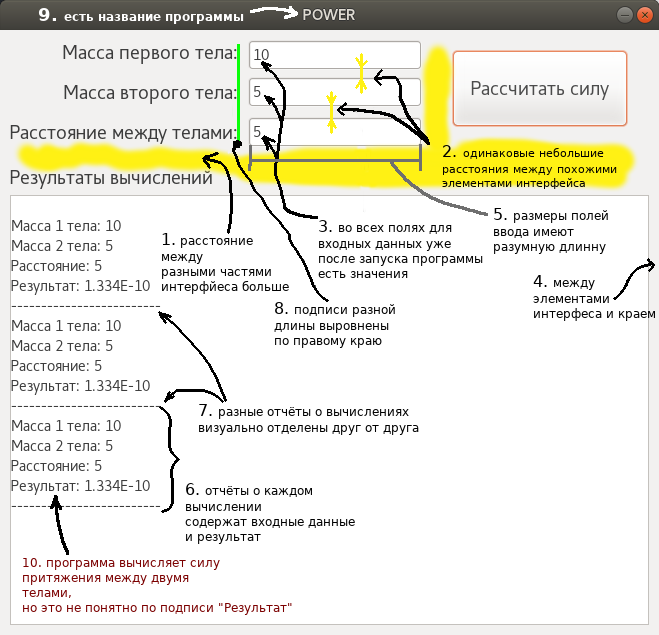

# 25 марта

## Лекция.
- Конспект [Лекция UX](https://github.com/ivtipm/HCI/blob/master/HCI_lec_4.%20UX.pdf)
- слайды 1-38
- конспект можно сделать в электронном виде (или взять слайды лекции), добавить свои пометки и комментарии, затем распечатать добавив к своему бумажному конспекту
- изучить все приведённые в слайдах ссылки, дополнить конспект краткой информацией из ссылок


## Лабораторное занятие
- Добавится в канал HCI
- Для ранее разработанные программы на Lazarus ( первые две задачи из задачника по программированию) выполнить следущее:
- Добавить меню программы (компонент TMainMenu) Файл с пунктами: Открыть, Сохранить, Сохранить отчёт, Выход;
- Пример работы с TMainMenu [gospodaretsva.com/urok-9-komponent-menyu-tmainmenu.html](https://gospodaretsva.com/urok-9-komponent-menyu-tmainmenu.html)
- Меню Файл:
  - Открыть -- показать диалоговое окно для выбора файла (в палитре компонентов: Dialogs - TOpenDialog). Загрузить данные из файла в поля входных данных главного окна.
  - Сохранить -- показать диалоговое окно (TSaveDialog) выбора файла для сохранения. Сохранить в файл все значения, что приведены в полях ввода на форме.
  - *Будет ли файл текстовым или типизированным вы выбираете сами. В самом простом варианте можно использовать текстовый файл, где все входные данные будут приведены в отдельных строках. Например, если входные данные два числа, то в файле будет две строки в каждой по одному числу.*
  - Сохранить отчёт -- показать диалоговое окно (TSaveDialog) выбора файла для сохранения. Сохранить содержимое Memo в текстовый файл
  ```
  Memo1.Lines.SaveToFile( имя_файла );
  ```
  - Выход - закрыть программу
  - *Пример работы с диалоговыми окнами выбора файлов: http://forinformatics.blogspot.com/2012/10/lazarus.html*
- Добавить меню программы (компонент TMainMenu) Справка
  - Справка -- открыть диалоговое окно (ShowMessage) с информацией: автор программы, номер задачи, условие задачи, ссылка на задачу в задачнике и на сайт автора программы (если есть)
  - https://wiki.freepascal.org/Dialog_Examples/ru
- Составить диаграмму вариантов использования (use case diagramm) для одной из программ. Диаграмма должна получится простой и лаконичной.
  - *Диаграмму можно рисовать в [draw.io](https://app.diagrams.net/) (компоненты диаграммы есть в разделе UML)*

#### Требования к программам
- Главное окно программы должно быть лаконичным, эстетичным и понятным пользователю
  - для каждого поля ввода должно быть видно название (TLabel)
  - все поля ввода должны быть уже заполнены
  - принципы гештальта [HCI_sem. Design, color, gestalt.pdf](https://github.com/ivtipm/HCI/blob/master/HCI_sem.%20Design%2C%20color%2C%20gestalt.pdf) должны быть соблюдены
  - Для расположения элементов интерфейса использовать привязки

  - TOpenDialog и др подобные компоненты помещаются на форму, но не видны пользователю. Поэтому их расположение не имеет значения.


  Пример неплохой формы (без меню)
  

- Помимо модуля главного кона программа должна содержать ещё один модуль с процедурами для записи\чтения файлов, вычислений.
- В процедуры этого модуля не должны передаваться компоненты интерфейса, а только их содержимое. Например в процедуру сохранения отчёта в файл нужно передать не Edit, а Edit.Text, который имет тип данных string.
- Имена (свойство Name) элементов интерфейса должны быть понятными
- Отправить эти две программы на проверку мне в slack (или отправить ссылку на свой репозиторий на github)
- Отправить диаграмму на проверку (можно ссылкой)


Пример
``` delphi
// Программа вычисляет сумму a и b
unit unit1;
  /// ...

 ...Обработчик для меню Открыть...
var
    filename: string;  
begin
  filename: = // из диалогового окна
  // проверка: пользователь выбрал имя файла? Если не выбрал, то диалоговое окно вместо имени файла выдаст пустую строку

  // функция вычисления переменных a и b (она должна быть в отдельном модуле)
// a и b — это глобальные переменные модуля формы (Unit)
  read_params(a,b/);
  // формальные параметры a и b передаются по ссылке, т.е. функция должны быть объявлена так
  procedure read_params(var a: real; var b: real; filename: string);

  edit_a.text = floattostr(a);
  edit_b.text = floattostr(b);

end;

```


Пример структуры модуля с функциями записи\чтения файлов и вычислений.
```delphi
unit progr_1_unit;

interface

// читает два числа из текстового файла с именем filename. числа должны быть расположены в отдельных строчках файла
procedure read_params(var a: real; var b: real; filename: string);

// сохраняет два числа в текстовый файл с именем filename, каждое число записывает в отдельную строку
procedure save_params(a,b: real; filename: string);

procedeure

// вычисляет сумму двух чисел и возвращает результат
function calc_c(a,b: real): real;

```


Подход, когда код отвечающий за интерфейс (здесь это обработчики событий главного окна, модуль Unit1.pas) и за логику работы программы (модуль progr_1_unit.pas) называется **разделение и интерфейса и логики**.

Это позволяет легко изменять интерфейс программы (в примере это Unit1 и не приведённый здесь файл формы) не изменяя основных процедур функций реализующих логику работы (здесь это модуль progr_1_unit).

Кроме того, модуль с логикой программы легко использовать и в другой программе, где могет понадобится аналогичные процедуры или функции. Например его можно сипользовать в консольной программе, которая решает ту же самую задачу.
