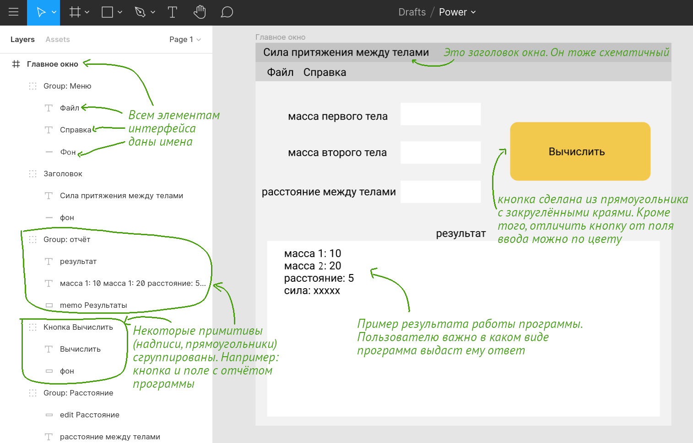

# апрель 22 (обновлено 27 апреля)

- игнорировать задание по ЧМВ на сайте университета

## Лекция.
- Изучить слайды https://github.com/ivtipm/HCI/blob/master/HCI_lec_5.%20Usability.pdf
- Изучить задания для лабораторной роботы
- Изучить инструкцию по работе в figma: 1. https://www.youtube.com/watch?v=ljUGwDWTDX8, 2. https://www.youtube.com/watch?v=eVqzc66u7Vg 3. https://www.youtube.com/watch?v=IpWjaNidZNw
- Рекомендуется время от времени ставить видео на паузу и повторять в figma то, о чём рассказывается в роликах.
- Само видео удобнее смотреть на скорости 1.25
- Основное, что нужно изучить:
  - из чего строится экран (окно)
  - работа с основными инструментами в figma: выделение, текст, прямоугольник, фрейм
  - как изменять цвета
  - как скруглять углы у прмоугольника

## Лабораторное занятие. Макет UI в Figma

Как вы выяснили, проектируя программные продукты мы в первую очередь должны заботится о пользователе. Поэтому и сам процесс проектирования программного продукта превращается практически в проектирование опыта пользователя (UX), только с той разницей, что нужно ещё проектировать внутреннее устройство программы.

Ответить на вопросы:
- На какие этапы разделяется проектирование опыта пользователя?
- Какие из этапов вы приходили (хотя бы частично) разрабатывая две программы с предыдущих занятий? Что делали на этих этапах?

Две программы с предыдущих занятий оказались достаточно простыми, учебными и поэтому не в каждом варианте можно было представить пользователя, которому действительно бы они понадобились. Поэтому этап Стратегии (из уровней UX) был пропущен, для этапа Возможностей была изображена диаграмма прецедентов. Которая, на самом деле, должна была предшествовать разработке программы. Ею разработчик должен пользоваться создавая программу. После заказчик программы должен сравнить утверждённую им диаграмму прецедентов и программу: все ли прецеденты (возможности) реализованы в программе?

В разработанной программе фигурируют четыре окна: основное окно, окно сохранения файла (на самом деле их два, для отчёта и параметров, но они очень похожи), окно открытия файла и окно справки. Они могут быть представлены (без оказания конкретного внешнего вида) на диаграмме окон, на уровне Структуры.

Задание:
0. Выбрать одну из двух программ, для которых будет проделано следующее
1. Создать диаграмму окон (пример на слайде 42 лекции по UX):
  - схематично (прямоугольником) отметить каждое окно,
  - подписать назначение каждого окна (главное окно, окно справки и т.д.)
  - стрелками показать из какого окна можно открыть каждое окно (в итоге должна получится древовидная структура)
  - сохранить диаграмму в редактируемый формат (например drawio или ссылку drawio)
  - сохранить диаграмму в виде растровой картинки (например png или jpg)
2. Зарегистрироваться на онлайн-сервисе [figma.com](https://www.figma.com/)
3. В figma, для программы, к которой строилась диаграмма прецедентов на одном из прошлых занятий, создать макет интерфейса (примеры на слайдах 52-48 лекции по UX):
	- на диаграмме должно быть схематично представлено главное окно программы
	- так как диаграмма является макетом интерфейса, который должен легко 	поддаваться изменениям, то для диаграммы не нужно подбирать цвета, 	шрифты, иконки и изображения — всё должно быть схематичным.
  - макет программы может не совпадь в точности с интерфейсом ранее разработанной программы.

  В figma нет отдельных компонетов для кнопок, полей ввода и т.п. Поэтому всё нужно будет создать самостоятельно из прямоугольников и надписей.

  Каждому прямоугольнику (или другому элементу) нужно дать имя, описывающее его назначение.

  На диаграмме можно делать поясняющие подписи, но они должны восприниматся не как часть интерфйеса программы.
  
  - Добавьте в угол каждой диаграммы свою фамилию и инициалы.

  - Сохранить макет в формате .fig (Меню > File > Save as *.fig)
  - Сохранить макет в pdf (Меню > File > Export Frames to PDF)

  Пример: как выглядит макет в Figma

  

  [Файл макета](example-figma-1.fig)

  Открывать макет в Figma нужно так:

  

4. Создать в репозитории на github (с котором работали на прошлых занятиях) папку с названием «april 20» в которой должно быть:
- диаграмма окон (в виде изображения)
- макет интерфейса главного окна программы (pdf)
- скриншот из figma с макетом и его элементами (левая часть окна), как на первом рисунке. Это не обязательно, но ускорит проверку работу. (upd: **27 апреля** )

5. Отправить ссылку на репозиторий преподавателю для проверки

Следует отметить, что проектирование диаграммы окон программы и её интерфейса должно предшествовать созданию самой программы. Но цель этого учебного примера — только познакомится с созданием прототипов интерфейсов в figma.

[вернуться к списку заданий](https://github.com/ivtipm/HCI/blob/master/Tasks-2020-spring/Tasks.%202020-spring.md)**

<!-- 1. программа для генерации паролей
2. программа для вычисление длины тормозного пути
3. программа для предсказания числа заражённых
4. программа для определения количества лекарства в крови (организме) из времени полувыведения
5. программа для вычисления цены с учётом инфляции
6. Вычисление местного звёздного времени
7. Уравнение времени для солнечных часов
8. конвертер валют
9. перевод единиц измерения
10.
0. свой вариант (требуется предварительное согласование с преподавателем) -->
