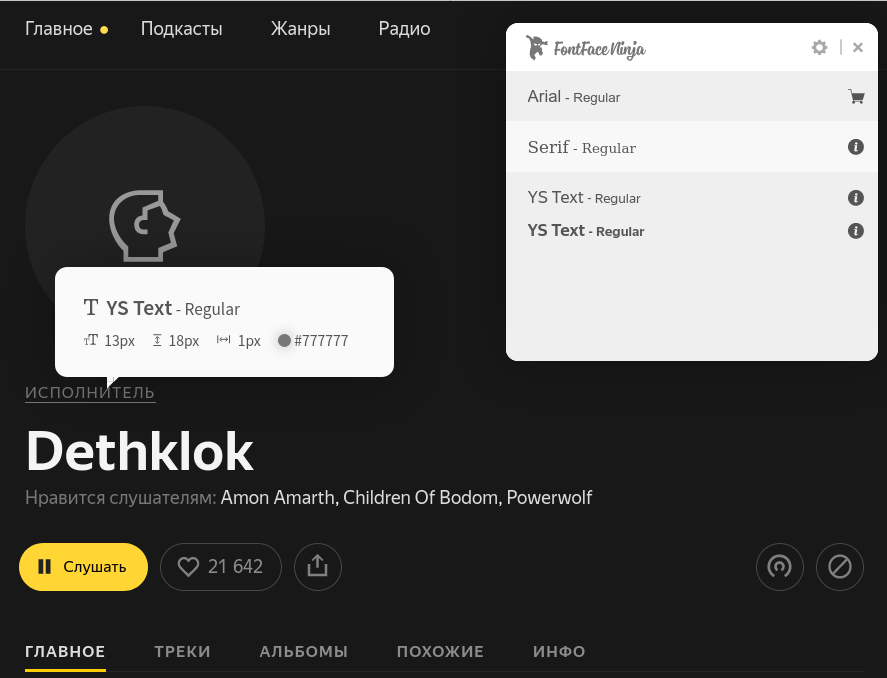
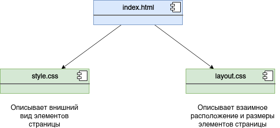
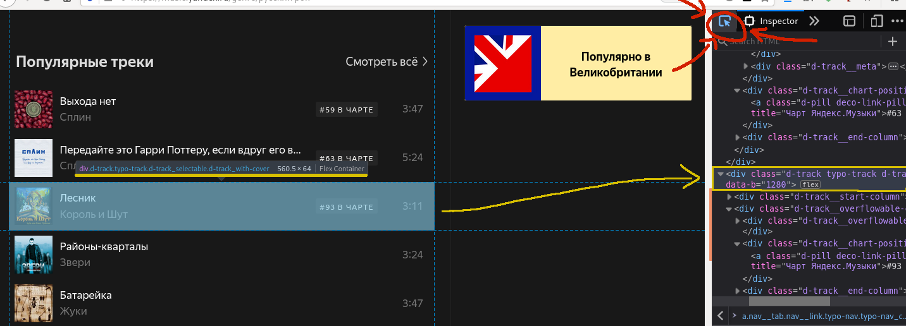
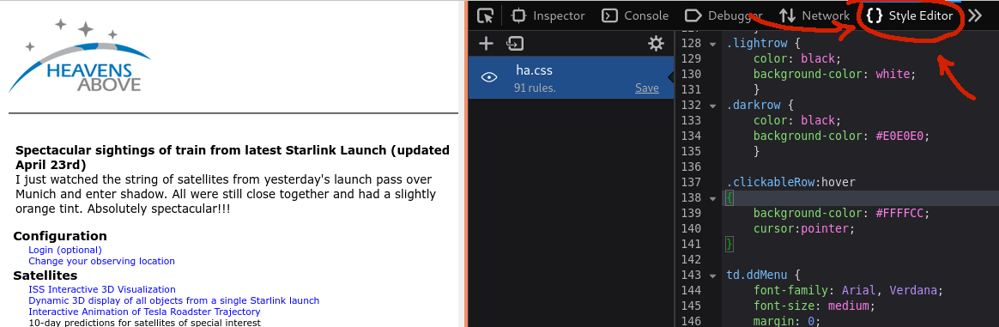

# 13 мая
## Лабораторное занятие.  Дизайн веб-странцы: типографика и цветовые схемы.

Игнорируйте задание по ЧМВ на сайте университета.

Задание расчитано на два занятия: 13 и 20 мая.

Типографика имеет особенно большое значение в вебе. Вы получаете информацию скорее всего в виде текста заходя почти на любой сайт. 

Цель занятия — научится настраивать шрифты и цвета для веб-страниц.

### HTML и CSS
- В основе веб-страницы лежат HTML и CSS файлы
- HTML файл отвечает за семантическую разметку, это каркас страницы
- HTML файл может содержать текст, который увидит пользователь
- CSS файл определяет, как HTML страница будет выглядеть: относительное расположение уже имеющихся в HTML блоков, их цвет, размер, шрифт т. д.

- HTML и CSS файлы описываются с помощью декларативных языков HTML и CSS

#### HTML
- HTML страница строится из блоков — тегов
- Теги, вложенные друг в друга, определяют структуру страницы и могут содержать в том числе текстовую информацию.
- Каждому строительному элементу может быть задан идентификатор (id). Здесь можно провести параллель с именем переменной. Один id может быть задан только для единственному тегу.
- Тегу также может быть задан класс (class). Один и тот же класс может быть задан разным тегам. Один и тот же тег может соответствовать разным классам.


#### CSS
- В CSS файле можно описать внешний вид каждого тега и класса
- CSS файл подключается в HTML файл.
```
<head>
    <meta charset="UTF-8">
    <title>Типографика и цветовые схемы</title>
    <link rel="stylesheet" href="css/layout.css">
    <link rel="stylesheet" href="css/style.css">
</head>
```
- для каждого тега или класса может быть задано множество аттрибутов, определяющих внешний вид этого тега или тегов с этим классом
- пример атрибутов: font — шрифт, color — цвет
- так в CSS обозначается комментарий:
```
/* комментарий */
```


- Пример описание свойств для тега body, отвечающего за всё содержимое страницы:

```
body {
      font: 20px/24px Roboto; 
      /* размер шрифта 20px, высота строки 24px, гарнитура Roboto*/
}
```

- Одну гарнитуру можно задать для целой страницы, а на отдельных элементах изменять размер шрифта, его толщину и начертание (прямое, наклонное или курсив)
```
h1{
 font-size: 36px; 
/* увеличим размер шрифта для заголовка */
font: italic;  
/* сменим начертание на курсив */
font-weight: 600;
/* увеличим толщину шрифта. Толщина для всех шрифтов может меняться от 100 до 800. 400 - шрифт с нормальной толщиной */
color: #112233;
/* зададим цвет шрифта (RGB, R=11, G=22, B=33) */
background: #eeeeee;
/* и цвет фона */
}
```


### Задание
1. Изучите шрифты и цвета на странице университета: [zabgu.ru](http://zabgu.ru/php/index.php).
 - Определите: основный цвет, дополнительный, акцидентный, основной цвет для текста и дополнительный цвет для текста.
 Какой цвет основной, какой цвет основной для текста, какой цвет акцидентный?
 - Используйте встроенный в Firefox инструмент Пипетка (eyedropper). Найдите его в инстрементах разработчика.
 - Какие шрифты используются?
 - Каким шрифтом выделены основные пункты меню (в синих прямоугольниках)
 - Кокой шрифт используется для основного текста (зайдите в любую новость чтобы посмотреть)
 - Как цвет фона влияет на цвет шрифта
 - Как выделено заголовок в новости, первый абзац?
 - С какими решениями вы несогласны?
 - Для определения шрифтов рекомендуется плагин для браузера [Font Ninja](https://addons.mozilla.org/en-US/firefox/addon/fonts-ninja/?src=recommended). Установите, нажмите на значёк этого плагина. Появится окно с описанием всех шрифтов на страницен. Наведите на надписб чтобы увидеть описание её шрифта. Будте внимательны, иногда после наведения элемент меняет цвет текста, Font Ninja тогда покажет именно этот цвет.
 - Опишите цвета и шрифты в документе. Для цвета нужно привести его код в виде `#rrggbb`и закрашенный тем же цветом прямоугольник. Можно организовать это в таблицу и закрасить её клетки.
 - На сайте можно найти много цветов, приведите только 3-4 основных.
 <br></br>
2. Вам предоставлен шаблон простой html страницы (https://github.com/ivtipm/HCI/tree/master/Tasks-2020-spring/page-for-typography-and-colors). Он состоит из трёх файлов.

 - Скачайте всю папку. Можно скачать файлы по отдельности, и сохранить css файлы в папку css. Но рекомендуется сделать clone всего репозитория:
 ```
 git clone https://github.com/ivtipm/HCI.git
 ```
 Если вы уже делали такое клонирование репозитория некоторое время назад, то просто обновите локальной копии данные, чтобы не загружать целиком заново: зайдите в папку с репозиторием, откройте в ней консоль Git Bush и выполните пулл
 ```
 git pull
 ```
 - Откройте файл (`index.html`) в браузере. Рекомендуется Firefox, он удобен для наших целей. В ***режиме разработчика*** (F12 или через меню) перейдите в ***Инспектор***. В инспекторе можно изучать устройство страницы, её код, наводя указателем на её части. <br></br>
3. Изучите основные блоки страницы и теги, которые за них отвечают.
 - Сделайте скриншот браузера c одним из выделенных блоков страницы в режиме инспектора. Для создания снимка экрана нажмите alt+PrtSrc, файл сохранится в папку Изображения. Переименовать файл как dev-view.jpg.
 - Должно получится что-то похожее на это, только без пометок
 <br></br>
4. Откройте CSS файл style.css в браузере (вкладка ***Редактор стилей***). Вы должны увидеть что-то такое:
 <br></br>
5. Изучить, как работает изменение стилей. Например:
    1. Измените шрифт для тега body на Courier.
    ```
    body{
      font-family: Courier, serif;
      ...
    ```
 В Firefox, если вы всё сделали правильно, шрифт тут же поменяется и на странице. В других браузерах может понадобиться обновить страницу.
 В коде выше приведено вообще-то две гарнитуры для страницы: Courier и семейство шрифтов serif (с засечками). Второй шрифт (один из семейства) будет использован браузером, если ему будет недоступен первый.
    1. Изменить цвет фона и текста для тега h2 (заголовок второго уровня). Код желаемого цвета удобно подсмотреть в google: hex color.
```
h2{
  color: #000000;
}
```
6. Изучите начало файла `style.css`. Там приведены переменные для цветов отдельных элементов и размеры шрифтов. Наведите на имена отдельных блоков (они называются селекторами) в браузере, например h1. Все элементы, соответствующие этому блоку, выделятся на странице.
7. Задайте свои шрифты (гарнитуру, размер, начертание, толщину).
8. Задайте свои цвета.
Рекомендуется изменять только значение аттрибутов помеченных комментирием `/* !!! */`
9. Сохранить страницу как PDF файл (меню -> печать -> печать в файл).
10. Загрузить в репозиторий, в папку may 13 файлы:
 - pdf документ с описанием цветов и типографики сайта ЗабГУ: `zabgu-design.pdf`
 - скриншот режима разработчика с инспектором `dev-view.jp`
 - pdf файл страницы `my-page-design.pdf`
 - HTML страницу и CSS файлы

### Рекомендации.
1. См. рекомендации о цветах в [лекции о дизайне](https://github.com/ivtipm/HCI/blob/master/HCI_sem.%20Design%2C%20color%2C%20gestalt.pdf)
1. Старайтесь с осторожностью использовать большое количество цветов. 
1. Старайтесь не использовать много гарнитур. Одной гарнитуры, но с разным начертанием, толщиной и размерами шрифта. Но если хочется, то можно подобрать (или где-то подсмотреть) шрифтовую пару.
1. Выполнять и сдавать задание лучше за два раза. В одну неделю можно выполнить пункты 1-5 и загрузить в репозиторий скриншот, потом 6-8 и загрузить всё остальное.
1. Сделайте 2-3 варианта цветовой схемы. Даже если они не сильно отличаются. Потом выберете лучший вариант.


### Что оценивается в работе?
1. Различимость, читаемость и эстетика шрифта, с учётом цвета фона.
1. Эстетика цветовой схемы.


[вернуться к списку заданий](https://github.com/ivtipm/HCI/blob/master/Tasks-2020-spring/Tasks.%202020-spring.md)

# Ссылки
1. [HTML и CSS](http://htmlbook.ru/)
1. [лекция по дизану и цветам](https://github.com/ivtipm/HCI/blob/master/HCI_sem.%20Design%2C%20color%2C%20gestalt.pdf)
<!-- 1. Ссылка на лекцию про типографику -->
<!-- 1. Ссылка на лекцию про дизайн и цвета -->
<!-- 1. Ссылка на цветовые схемы? -->
