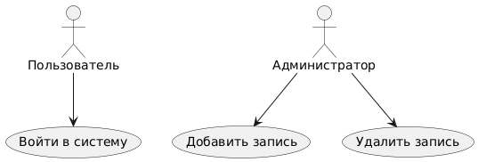

# PlantUML

PlantUML — язык разметки для описания диаграмм UML и иных типов (потоков, диаграмм вариантов и состояний, временных линеек, объектных и структурных диаграмм).

Из текстового описания можно создавать диаграммы в виде изображений.

Так как диаграммы описываются в тексте, их можно редактировать в любом месте; можно переносить отдельные части диаграмм; можно не беспокоиться о расположении блоков, т.к. это происходит автоматически при создании картинки из диаграммы; легко отслеживать изменения с помощью системы контроля версий, например Git.

Сайт с примерами и описанием языка разметки: https://plantuml.com/

Страница для создания визуализаций (изображений) из plantuml кода: https://www.plantuml.com/plantuml/


## Основы PlanUML

Каждая диаграмма должна начинаться с @startuml и заканчиваться @enduml:

```plantuml
@startuml
...описание диаграммы...
@enduml
```

**Комментарии**

```
' Это однострочный комментарий

/'
 Это
 многострочный
 комментарий
'/
```

**Заголовоки и т.п.**
```
' Заголовок
title Диаграмма вариантов использования

' Подпись внизу изображения
caption Автор: И.И. Иванов \n Версия 1.0 \n 2025 г

header Это текст для верхнего колонтитула: Диаграмма системы учета пользователей
footer Это текст для нижнего колонтитула: Автор: Иванов И.И. | Версия 1.0 | 2025
```


**Псевдонимы (идентификаторы)**

Можно задавать псевдонимы через `as`, чтобы переиспользовать имена:
```
actor "Системный администратор" as Admin
```


**Расположение элементов**
Можно использовать left, right, up, down для расположения элементов:
```
actor Пользователь
usecase UC1
Пользователь -left-> UC1
```


**Виды стрелок**
```
-->    обычная стрелка
->     тонкая стрелка
<--    влево
<->    двунаправленная

-->>   стрелка с двойным наконечником
..>    пунктирная стрелка

--|>   стрелка с закрашенным треугольным наконечником  (для обозначения обобщения)
o--    для обозначения агрегации
*--    для обозначения композиции

==>    жирная стрелка

Пользователь --> UC1 : подпись для стрелки
```

**Аннотации (примечания)**
Добавление примечаний осуществляется с помощью note.
Примечание к элементу UC1
```
note right of UC1
  Требуется авторизация
end note
```

Можно задать расположение элемента: right, left, top, bottom

**Расположение блоков**
В начале файла можно задать основной порядок расположения элементов. Например
```
left to right direction
```

**Стиль, цвета и т.п.**

Цвет фона
```
usecase "Добавить" as UC2 #blue
usecase "Добавить" as UC2 #ff00ff
```

Цвет линий, толщина линий, цвет текста:
```
actor Basicuser #pink;line:red;line.bold;text:red
```


можно использовать skinparam для глобальной настройки стиля:
```
skinparam usecaseBackgroundColor LightBlue
skinparam usecaseBorderColor Black

skinparam backgroundColor #FFDD99
skinparam classBackgroundColor RGB(200,255,200)
skinparam noteBackgroundColor HSV(0.5,0.8,0.9)
```

**Разрешение изображения**

По умолчанию диаграммы plantuml при экспорте в png имеют низкое разрешение. 
```
skinparam dpi 300
```

## Стиль для отдельных элементов
Можно отдельно описать стиль для элементов диаграммы: акторов, прецедентов, классов и т.п.

Например описание стиля классов:
```
<style>
class{
    BackgroundColor: LightBlue;
    FontColor: red;
    LineColor: yellow;
}
</style>
```

Перечень свойств: https://plantuml.com/style-evolution

Пример настройки стиля всех акторов
```
<style>
' Настройка стиля всех акторов
actor {
    ' Цвет фона
    BackgroundColor LightGreen
    
    ' Цвет и толщина линий
    LineColor green
    LineThiCkness 2

    ' Текст:
    ' Можно привести список шрифтов, будет использован первый, из доступных в ОС
    ' Можно задать только категорию шрифта: serif, sans, monospaced
    FontName "Fira Code", monospaced
    ' Начертание
    FontStyle italic
    ' Размер
    FontSize 20
    ' Цвет
    FontColor DarkGreen
}
</style>
```

**Задание глобальных параметров для диаграммы**
```
' Задать параметры для диаграммы классов
classDiagram{
    LineColor #888;
}
```


Стиль для конкретного элемента можно задать через специальный стереотип (метку)
```
<style>
    ' Задание стиля для стереотипа (метки)
    ' Название стереотипа должно начинаться на точку (как селектор в CSS)
    .my_class {
            BackgroundColor green;
    }
</style>


' Скроем стереотип с диаграммы;
hide <<my_class>> stereotype


' Добавим для класса стереотип
interface IWorker <<my_class>>{
   + work();
}

class Worker{
   + work();
}
```
## Основные элементы (для диаграмм прецедентов / вариантов использования)

```
actor Пользовательская_роль

' UC1 - идентификатор варианта использования
usecase "Вариант использования" as UC1


' Отношение между ролью и прецедентом
Пользовательская_роль --> UC1
```


## Пример диаграммы вариантов использования
```
@startuml
actor Пользователь
actor "Администратор" as Admin

usecase "Войти в систему" as UC1
usecase "Добавить запись" as UC2
usecase "Удалить запись" as UC3

Пользователь --> UC1
Admin --> UC2
Admin --> UC3
@enduml
```



# Ссылки
- См. также mermaid диаграммы - более простой язык описания диаграмм, которые могут изображаться большинством программ отображающих markdown
- Полное руководство по языку PlantUML: https://pdf.plantuml.net/PlantUML_Language_Reference_Guide_en.pdf