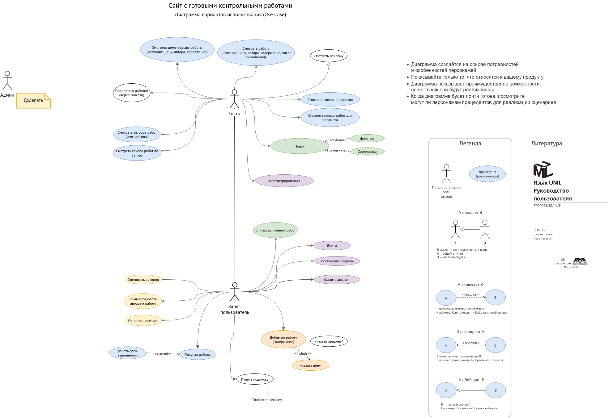

# Проектирование пользовательских интерфейсов
## О курсе
### Чему научитесь?
- Разрабатывать простые приложения с графическим интерфейсом на Lazarus.
- Основы проектирования пользовательского интерфейса, начиная с этапа анализа требований
- Описывать целевую аудиторию продукта (программы\сайта), их потребности
- Описывать возможности продукта, их взаимосвязи и группировать по пользовательским ролям
- Проектировать информационную архитектуру продукта (как устроена программа\сайт с точки зрения пользователя)
- Создавать грубые макеты пользовательского интерфейса в Figma
- Некоторые важные принципы создания графического пользовательского интерфейса
- Оценивать качество пользовательского интерфейса, применять некоторые модели для количественной оценки качества ПИ
- Основам типографики и написанию интерфейсных текстов.

Во второй половине курса разработаете (полностью или частично) проект пользовательского интерфейса продукта на выбранную тему и требования к его возможностям.
Разработку проекта можно вести в парах. Предполагается полное участие каждого члена команды во всех этапах работы над проектом.


### Экзамен
Есть возможность получить оценку удовлетворительно автоматически (при вашем согласии) после выполнения необходимого минимума работ.

Отвечая по билету можно получить оценку удовлетворительно или выше. 


### Материалы
- Слайды в этом репозитории
- [Учебное пособие](../../StudBook.pdf)


# Лекция 1. Введение.
Изучите первую и вторую главы учебного пособия.

# Практика 1. Доклады. Основы Lazarus

**Настройка Lazarus**
- превратить окна Lazarus в панели (однооконный режим) - https://devlaz.ru/lazarus-%D0%B2-%D0%BE%D0%B4%D0%BD%D0%BE%D0%BC-%D0%BE%D0%BA%D0%BD%D0%B5/
- Не открывать проект при запуске: Tools > Options... > Enviroment: снять галочку "Open last project..."
- Использовать подсветку синтаксиса с гармоничными цветами: Tools > Options... > Editor - Display - Colors: в выпадающем списке вверху выбрать Delphi вместо Default
- Запретить ставить курсор дальше конца строки: Tools > Options... > Editor - General: в разделе Caret (Text Cursor) убрать галочку для Allow caret to move past end of line
- Другие настройки: http://newpascal.org/docked.html


# Задание 1. Доклад о проблемах дизайна.
1. См. задание 1 в [ЧМВ. Задания.pdf](<../../ЧМВ. Задания.pdf>)
2. Рассматривайте только те объекты дизайна, сайты программы или устройства, которыми пользовались.


# Задание 2. Простая программа с GUI

Пример с подробными комментариями:\
https://github.com/ivtipm/HCI/tree/master/Lazarus-examples/Memo_Menu

[Пример2](2022/lazarus_example_1)

Настройте Lazarus как показано выше.

Создайте программу на Lazarus с графическим интерфейсом пользователя
  - программа должна решать [задачу из вашего варианта](https://ivtipm.github.io/Programming/Files/spisocall.htm), из первого блока задач по программированию.
  Если задача из задачника не несёт большого смысла (содержит абстрактную формулу, слишком простая и т.п.) рекомендуется предложить свою задачу. Например вычисление итоговой суммы по вкладу, решение квадратного уравнения, генерирование случайного пароля по заданным параметрам, конвертер валют с указанием курса и т.п.
    - своя тема принимается после согласования с преподавателем
  - для ввода и вывода данных используйте компоненты TEdit и TLabel, для запуска вычислений -- кнопку.
  - приведите условие задачи прямо на форме
  - подпишите все поля ввода
  - подпишите выходные данные
  - не забудьте задать имя для окна
  - сделайте дизайн окна аккуратным
  - не обязательно:
    - добавьте компонент TImage, например с картинкой поясняющей условие или вычисления (http://smdsc5.ru/2019/02/25/lazarus-%D1%83%D1%80%D0%BE%D0%BA-%E2%84%96-3/)

**Дополнение**
1. добавьте компонент TMemo и вывод отчёта о вычислениях в него после каждого нажатия кнопки. Старые отчёты из TMemo не удаляйте. (https://wiki.freepascal.org/TMemo/ru)
2. Привяжите границы Memo к границам окна. Сделайте форму компактной и аккуратной. Помните про принцип близости. Используйте редактор привязок (якорей).
3. Сделайте проверку вводимых данных, меняйте цвет полей с ошибками, выводите сообщения об ошибке в Memo. Выделение поля ввода должно гармонично смотреться. Не выводите сообщение во всплывающем окне. Оно требует от пользователя дополнительного действия, может раздражать. 
4. Чтобы модуль окна соблюдал принцип единственной ответственности, вынесите вычисления в отдельной модуль.
5. Напишите комментарии и документируйте код.
Указывайте автора программы в каждом файле. Объясняйте все сложные, новые для вас части кода. Пишите документирующие комментарии. 
См. пример https://github.com/ivtipm/HCI/tree/master/Lazarus-examples/Memo_Menu

**Критерии оценки программы**
- решает поставленную задачу
- написана согласно шаблону MVC
- код документирован
- корректные идентификаторы
- понятный, удобный, лаконичный, аккуратный и эстетичный дизайн окна


**Подсказки**

```pascal
uses Math;

...
// Округление действительного числа до двух знаков после запятой.
RoundTo( 3/7, -2 )
```


# Задание 3. Конспект
- Конспект: Создание программ с графическим интерфейсом пользователя на Lazarus
  - Как создать проект; как сохранить и открыть
  - Основные окна (панели) Lazarus
  - Из каких файлов исходного кода состоит программа? Как они между собой взаимодействуют?
  - Как создать обработчик события  нажатие на кнопку
  - Элементы интерфейса:
    - кнопка, поле ввода, надпись;
    - как изменить надпись, содержимое?
    - как изменить имя переменной, отвечающей за элемент интерфейса?
    - как посмотреть список форм и модулей?
  - приведите в конспекте это задание и ссылку на него
  - сделайте конспект кратким; приведите ссылки на источники


### Ссылки
- http://www.freepascal.ru/
- http://intuit.valrkl.ru/course-1265/index.html - Программирование на Lazarus
- http://www.freepascal.ru/download/pdf/osnovy_programmirovanija_v_srede_lazarus.pdf - Основы программирования в среде Lazarus
- https://www.youtube.com/watch?v=VWHec3Fwuck - Уроки программирования в Lazarus. Урок №1. Обзор среды программирования, типов проектов в Lazarus


# Практика 2. Доклады.


# Лекция 2. Юзабилити. GOMS
1. Повторение. Опрос.
2. Модель GOMS.

См. домашние задания выше.

Изучите раздел про GOMS из учебного пособия.


# Домашнее задание 4. Бонус. Интеллект-карта.
К концу семестра создайте интеллект-карту (mind-map), отражающую структуру дисциплины, важные понятия, литературу и другие источники.
Используйте изображения, схемы, ссылки, формулы, цветовое кодирование и т.д.

Создавайте диаграмму в специальной программе (онлайн-приложении), например  draw.io


# Лекция 3. Lazarus
0. Повторение. Опрос.

# Задание 5. Простая программа с GUI (продолжение)
Доработайте программу из домашнего задания 3.

**Горячие клавиши (hotkeys), подсказки (hints), порядок обхода**\
Почти все приложения с графическим интерфейсом предполагают, что ими будут пользоваться с помощью мыши.
Но в правильно построенном интерфейсе использование клавиатуры может повысить эффективность работы пользователя.
Чтобы кликнуть на кнопку или пункт меню нужно сначала навести указатель.
Почти всегда это занимает больше времени, чем нажатие несложной комбинации клавиш на клавиатуре.

Можно пользоваться клавишей <kbd>tab</kbd> чтобы сменять фокус элеентов интерфейса. Задайте порядок обхода элементов (tab order) чтобы они выбирались в логичном порядке. Напишите в комментариях, в главном модуле программы, как это сделали.

1. Добавьте главное меню в программу. Добавьте пункты Выход и Об авторе.
1. Добавьте обработку горячих клавиш двумя способами
    - **Горячие клавиши через надпись на элементе интерфейса**
    - Поставьте амперсанд (`&`) перед буквой в надпись на кнопке. Например `&Вычислить`. Теперь кнопку можно нажать с помощью сочетания клавиш <kbd>Alt</kbd>+<kbd>В</kbd>. Можно использовать любой символ на клавиатуре для такой горячей клавиши. Выберете наиболее логичный.
    - Посте того как пользователь нажмёт на <kbd>Alt</kbd> в окне выделятся все буквы на элементах интерфейса, для которых включены сочетания клавиш.
    - Включите подсказку при наведении курсора (свойство `ShowHint = True`);
      - Задайте подсказку о горячей клавише (свойство `Hint`)
   - **Горячие клавиши через TActionList**
   1. Добавьте из раздела Standart (Стандартные) компонент TActonList (последний в этом разделе)
   1. Измените название переменной, отвечающей за этот элемент интерфейса.
   1. Добавьте новое Действие (Action): правый клик на ActionList > EctionListEditor... > `+`
   1. В инспекторе объектов:
     1. Переименуйте появившуюся переменную Action в ActionExit
     1. В свойстве `ShortCut` задайте сочетание клавиш <kbd>Ctrl</kbd>+<kbd>Q</kbd>`
     1. Перейдите на вкладку Events (События), в `OnExecute` кликните на `...` чтобы создать обработчик события.
  1. Вызовете функцию закрытия окна в обработчике
  1. Задайте горячие клавиши для всех возможностей программы  


### Задание 6 (бонус). GOMS
1. Исследуйте интерфейс своей программы методом GOMS
2. Рассмотрите несколько вариантов. Предложите улучшения.


### Задание 7 (бонус). CMD IU
Создайте вариант программы из задания 2, но с командным интерфейсом. Передавайте данные как параметры командной строки. Например: `my_program.exe 10 20 30`.\
Используйте прежний модуль для вычислений. Предусмотрите обработку аргумента `--help` или `-h`, запуска программы без аргументов.

См. раздел 2.2.1 Реализация интерфейса командной строки в учебном пособии.


### Задание 8. Отчёт о минимизации размера исполняемого файла
Сделайте конспект и отчёт о том, как уменьшить размер исполняемого файла при компиляции в Lazarus.

# Защита работ
-    Из каких файлов состоит программа? Какие отношения между ними?
-    Что такое шаблон проектирования MVC?
-    Как изменить имя, содержимое поля ввода, лейбла?
-    Как создать обработчик события?
-    Что такое обработчик события?
-    Как программно изменить содержимое и цвет лейбла, поля ввода?
-    Зачем нужны функции StrToFloat, FloatToStr, TryStrToFloat? Как они работают?
-    Как вывести значение переменной в Memo? Как сохранить содержимое Memo в текстовый файл?
-    Что такое класс?
-    Как создать модуль?
-    Как создать меню приложения?
-    Как работать с диалоговыми окнами для выбора файла?
-    Что такое принцип близости (гештальт психология)
-    Что такое привязки (anchors)? Для чего они нужны?
-    Что такое ментальная модель, модель реализации, модель представления? Как эти понятия соотносятся с вашей программой?
-    Что такое проклятье знания? Как оно может мешать разработчику?


# Лекция 4. Lazarus. Проектирование UX
- Методы и поля. Составное имя метода.
- Организация проверки входных данных.
- MVC. Замечания о типах хранимых данных, о месте хранения.
- TStringGrid. 
- Понятие UX. Проектирование продукта (UX). Метод персонажей.

Cм. в дискорде запись занятия. 

### Задание 9. TStringGrid

Создайте программу решающую задачу из сроки 48 [задачника](https://ivtipm.github.io/Programming/Files/spisocall.htm).
- Для вывода матрицы используйте компонент TStringGrid.
- Используйте записи. Храните данные в отдельном массиве.
- Сделайте функцию для записи данных в таблицу.
- Реализуйте загрузку и сохранение данных. Используйте TMainMenu и диалоговые окна для выбора имён файлов.


Соблюдайте принципы процедурно-модульного программирования, комментируйте и документируйте код.


### Работа над проектом - 1
Опишите 2-4 персонажей и 2-4 сценария использования: 
https://raw.githubusercontent.com/ivtipm/HCI/master/%D0%A7%D0%9C%D0%92.%20%D0%97%D0%B0%D0%B4%D0%B0%D0%BD%D0%B8%D1%8F.pdf


# Лекция 5. UseCase. Информационная архитектура.
[StudBook.pdf](https://raw.githubusercontent.com/ivtipm/HCI/master/StudBook.pdf)
 4.2.4 Диаграмма прецедентов

Пример фрагмента диаграммы вариантов использования: 
Диаграмму можно открыть в draw.io если загрузть файл.


### Работа над проектом (продолжение)
Выполните задания 2 и 3.
[project_tasks](../../Project_tasks/project_tasks.md)\
Закончите их за три недели.

**Ссылки**
- https://app.diagrams.net -- для создания диаграмм; можно экспортировать диаграмму в png, векторная копия диаграммы будет включена в файл.
Фигма:
  - https://www.figma.com
  - https://help.figma.com/hc/en-us/articles/360039818254-Create-overlays-in-your-prototypes -- создание диалоговых окон


# Экзамен
3 июня, 9.00, ауд 400